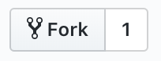
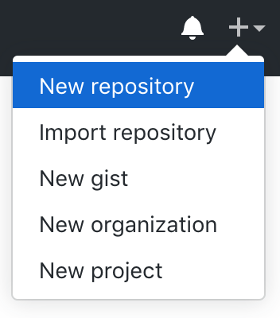
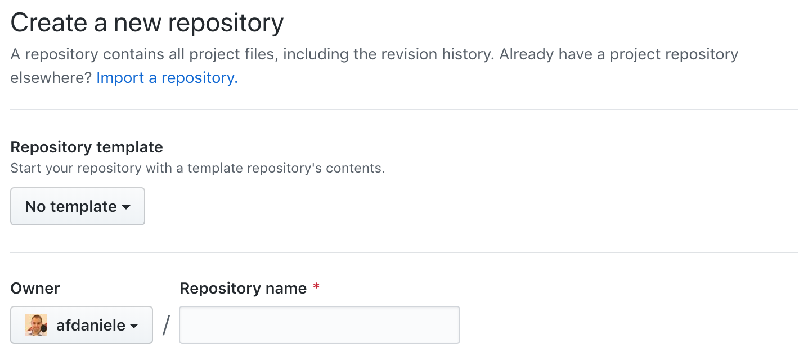
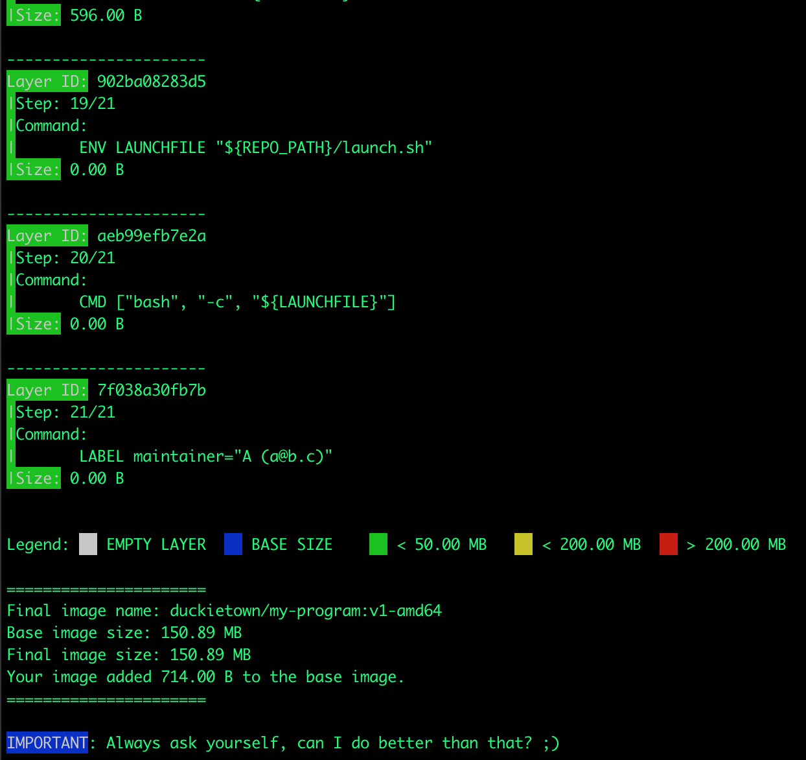

# Python programs and environments {#python-programs-environments status=ready}

Excerpt: Learn how to setup a Python project and associated tools.

We assume you are already quite comfortable with Python. Nevertheless, when you work with big and complex projects, there are some subtleties that you must consider and some handy tools that can make your life easier. Let's take a look at some of these now.


<div class='requirements' markdown='1'>

  Requires: [Laptop setup](+opmanual_duckiebot#laptop-setup)

  Results: Developer knowledge of Python.
  
</div>
 
 

<minitoc/>


## Define a basic project structure  

In Duckietown, everything runs in Docker containers. All you need in order to run a piece of software in Duckietown is a Duckietown-compliant Docker image with your software in it.

A boilerplate is provided by the following [repository](https://github.com/duckietown/template-basic).

The repository contains a lot of files, but do not worry, we will analyze them one by one.

First of all, you will need to make a copy of the template in your own GitHub account. To do so, go to the repository and click on the fork button.

<figure>
  
</figure>

Now that you have a copy of the template, you can create new repositories based off of it. In order to do so, go to [GitHub](https://github.com/) and click on the button `[+]` at the top-right corner of the page and then click on *New Repository*.

<figure>
  
</figure>

You will see a page that looks like the following:

<figure>
  
</figure>

In the section *Repository template*, select *`![YOUR_NAME]/template-basic`*. Pick a name for your repository (say `my
-program`) and press the button *Create repository*. Note, you can replace `my-program` with the name of the repository that you prefer, make sure you use the right name in the instructions below.

This will create a new repository and copy everything from the repository `template-basic` to your new repository. You can now open a terminal and clone your newly created repository.

    laptop $ git clone https://github.com/![YOUR_NAME]/my-program
    laptop $ cd my-program

Note: Replace `YOUR_NAME` in the link above with your GitHub username.

The repository contains already everything you need to create a Duckietown-compliant Docker image for your program. The only thing we need to change before we can build an image from this repository is the repository name in the file Dockerfile. Open it using the text editor you prefer and change the first line from:

```Dockerfile
ARG REPO_NAME="<REPO_NAME_HERE>"
```

to

```Dockerfile
ARG REPO_NAME="my-program"
```

Save the changes. We can now build the image, even though there is not going to be much going on inside it until we place our code in it. To do that, open a terminal and move to the directory created by the `git clone` instruction above. Run the following command:

    laptop $ dts devel build -f --arch amd64

If you correctly installed Docker and `dts`, you should see a long log that ends with something like
 the following:

<figure id="fig:build">
  
</figure>

You can now run your container by executing the following command.

    laptop $ docker run -it --rm duckietown/my-program:v1-amd64

This will show the following message:

```
The environment variable VEHICLE_NAME is not set. Using '774a2521b42e'.
Adding /code/my-program to PYTHONPATH
Adding /code/dt-commons to PYTHONPATH
Activating services broadcast...
Done!

This is an empty launch script. Update it to launch your application.

Deactivating services broadcast...
Done!
```

Congratulations! You just built and run your first Duckietown-compliant Docker image.


