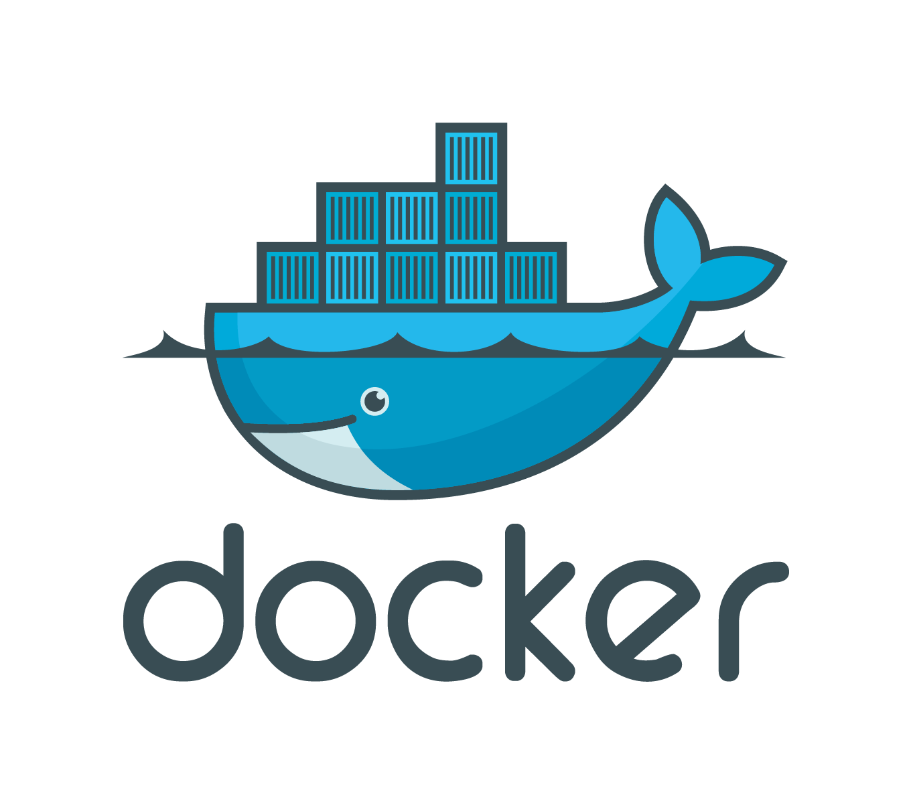

# Introduction to Docker for Robotics and Machine Learning {#docker-intro status=ready}

## Docker is a tool for portable, reproducible computing

It would be nice to give a computer - any computer with an internet connection - a short string of ASCII characters (say via a keyboard), press enter, and return to see some program running. Forget about where the program was built or what software you happened to be running at the time (this can be checked, and we can fetch the necessary dependencies). Sounds simple, right? In fact, this is an engineering task that has taken thousands of the world's brightest developers many decades to implement.

Thanks to the magic of [container technology](https://en.wikipedia.org/wiki/Operating-system-level_virtualization) we now can run any Linux program on almost any networked device on the planet, as is. All of the environment preparation, installation and configuration steps can be automated from start to finish. Depending on how much network bandwidth you have, it might take a while, but that's all right. All you need to do is type the string correctly.

## Docker containers are easy to install

Let's say you have never used Docker. To get Docker, run this command on a POSIX shell of any [Docker-supported platform](https://docs.docker.com/install/#supported-platforms):

    $ curl -sSL https://get.docker.com/ | sh

Now you have installed Docker!

Suppose your friend, Daphne, has a Docker **container**. How can we run this container? Docker containers live inside **registries**, which are servers that host Docker images. A Docker **image** is basically a filesystem snapshot---a single file that contains everything you need to run her container.

<figure id="docker_registry" markdown="1">
  
  <figcaption>Docker ships with a default registry, called the <a href="https://hub.docker.com">Docker Hub</a>, a big server that is home to many useful repositories.
  </figcaption>
</figure>

You can fetch Daphne's container by running the following command to pull it from her Docker Hub repository:

    $ docker pull daphne/duck

Now you have Daphne's Docker image. To see a list of Docker images on your machine, type:

    $ docker images

Every image has an image ID, a name and a tag:

    REPOSITORY      TAG        IMAGE ID         CREATED       SIZE
    daphne/duck     latest     ea2f90g8de9e     1 day ago     869MB

To run a Docker container, type the repository name, like so:

    $ docker run daphne/duck

Now you are running Daphne's container. To verify it is running, type:

    $ docker ps
    CONTAINER ID     IMAGE           ...     NAMES
    52994ef22481     daphne/duck     ...     happy_hamster

Note how Daphne's duck container has a *container ID*, a base image, and a funny-looking name, `happy_hamster`. This name is an alias for the container ID.

## Containers come from other containers

So you have a terminal and an internet connection? Now it doesn't matter what operating system you're running! You can run almost any Linux program in the world with just a few keystrokes. No further steps are necessary. How neat is that? To have a tool that clones a program and its environment, fetches the appropriate dependencies, and runs it on any OS is a big time-saver. Suppose you have a program that runs on one computer. It is extremely likely to run on any other, regardless of the underlying OS or hardware.

But how do you create a Docker **image**? There are two ways. You can either snapshot a running Docker container, or you can write a plaintext recipe. First, let's see how to create a snapshot:

    $ docker run -it daphne/duck bash

This will launch Daphne's container and drop us into a bash session within. Suppose we make a change to the Docker container like so:

    root@295fd7879184:/# touch new_file && ls
    total 0
    -rw-r--r-- 1 root root 0 May 21 20:52 new_file

However, this file is not permanent. Exit the container:

    root@295fd7879184:/# exit

Then rerun it:

    $ docker run -it daphne/duck bash

And run:

    root@18f13bb4571a:/# ls
    root@18f13bb4571a:/# touch new_file1 && ls -l
    total 0
    -rw-r--r-- 1 root root 0 May 21 21:32 new_file1

It seems like `new_file` has disappeared! Notice how the container ID (`18f13bb4571a`) is now different. This is because `docker run daphne/duck` created a new container from the image `daphne/duck`, rather than restarting our old container.

Let's see all the containers on our machine:

    $ docker container ls -a
    CONTAINER ID     IMAGE           ...     STATUS                              NAMES
    295fd7879184     daphne/duck     ...     Exited (130) About a minute ago     merry_manatee
    18f13bb4571a     daphne/duck     ...     Up 5 minutes                        shady_giraffe
    52994ef22481     daphne/duck     ...     Up 10 minutes                       happy_hamster

It looks like `295fd7879184` a.k.a. `merry_manatee` survived, but it is no longer running. Whenever a container's main process (recall we ran `merry_manatee` with `bash`) finishes, the container will stop, but it will not cease to exist.

In fact, we can resume the stopped container right where we left off:

    $ docker start -a merry_manatee
    root@295fd7879184:/# ls -l
    total 0
    -rw-r--r-- 1 root root 0 May 21 20:52 new_file

Nothing was lost! Let's open a new terminal (without leaving the current one) to see what other containers are running:

    $ docker ps
    CONTAINER ID     IMAGE           ...     NAMES
    295fd7879184     daphne/duck     ...     merry_manatee
    18f13bb4571a     daphne/duck     ...     shady_giraffe
    52994ef22481     daphne/duck     ...     happy_hamster

Now suppose we would like to share the container `shady_giraffe` with someone else. To do so, we must first snapshot the running container, or **commit** it to a new image, giving it a name and a tag. This will create a checkpoint that we may later restore:

    $ docker commit -m "fork Daphne's duck" shady_giraffe your/duck:v2

Wherever you see a funny-looking name like `shady_giraffe` in Docker, this is just another way to reference the container. We either can use the container ID, `18f13bb4571a` or the designated name (ie. `shady_giraffe`). The above `your` can be your username or an organization you belong to on a Docker registry. This image repository will be called `your/duck`, and has an optional version identifier, `v2`. Now we can push it to the Docker Hub registry:

    $ docker push your/duck:v2
    $ docker images
    REPOSITORY    TAG        IMAGE ID         CREATED          SIZE
    daphne/duck   latest     ea2f90g8de9e     1 day ago        869MB
    your/duck     v2         d78be5cf073e     2 seconds ago    869MB
    $ docker pull your/duck:v2 # Anyone can run this!
    $ docker run your/duck ls -l
    total 0
    -rw-r--r-- 1 root root 0 May 21 21:32 new_file1

This is a convenient way to share an image with your colleagues and collaborators. Anyone with access to the repository can pull our image and continue right where we left off, or create another image based on our own. Images can be created via the command line or by using something called a `Dockerfile`.

## Containers come from recipes

The second way to create a Docker image is to write a recipe, called a `Dockerfile`. A `Dockerfile` is a text file that specifies the commands required to create a Docker image, typically by modifying an existing container image using a scripting interface. They also have [special keywords](https://docs.docker.com/engine/reference/builder) (which are always CAPITALIZED), like [`FROM`](https://docs.docker.com/engine/reference/builder/#from), [`RUN`](https://docs.docker.com/engine/reference/builder/#run), [`ENTRYPOINT`](https://docs.docker.com/engine/reference/builder/#entrypoint) and so on. For example, create a file called `Dockerfile` with the following content:

    FROM daphne/duck       # Defines the base image
    RUN touch new_file1   # new_file1 will be part of our snapshot
    CMD ls -l             # Default command to be run when the container is started

Now, to build the image we can simply run:

    $ docker build -t your/duck:v3 .       # Where '.' is the directory containing your Dockerfile

You should see something like:

    Sending build context to Docker daemon  2.048kB
    Step 1/3 : FROM daphne/duck
     --- ea2f90g8de9e
    Step 2/3 : RUN touch new_file1
     --- e3b75gt9zyc4
    Step 3/3 : CMD ls -l
     --- Running in 14f834yud59
    Removing intermediate container 14f834yud59
     --- 05a3bd381fc2
    Successfully built 05a3bd381fc2
    Successfully tagged your/duck:v3

Now run the command `docker images` in your terminal, and you should see an image called `your/duck` with tag `v3`:

    $ docker images
    REPOSITORY    TAG        IMAGE ID         CREATED          SIZE
    daphne/duck   latest     ea2f90g8de9e     1 day ago        869MB
    your/duck     v2         d78be5cf073e     5 minutes ago    869MB
    your/duck     v3         05a3bd381fc2     2 seconds ago    869MB

This procedure is identical to the snapshot method we performed earlier, but the result is much cleaner. Now, instead of needing to carry around a 869MB BLOB, we can just store the 4KB text file and rest assured that all our important setup commands are contained within. Similar to before, we can simply run:

    $ docker run -it your/duck:v3
    total 0
    -rw-r--r-- 1 root root 0 May 21 21:35 new_file1

Notice that as soon as we run the container, Docker will execute the `ls -l` command as specified by the `Dockerfile`, revealing `new_file1` was stored in the image. However we can still override `ls -l` by passing a command line argument: `docker run -it your/duck:v3 [custom_command]`.

### Layer Caching

An important concept in Docker is the [*layers*](https://docs.docker.com/storage/storagedriver/#images-and-layers). One way to think of a layer is like a Git commit - a set of changes to a previous image or layer, identified by a hash code. In a `Dockerfile`, layers begins with a [keyword](https://docs.docker.com/engine/reference/builder/#from). Let's have a look:

    FROM daphne/duck
    RUN touch new_file1                             # Defines a new layer
    RUN mkdir config && mv new_file1 mkdir          # Each layer can have multiple commands
    RUN apt-get update && apt-get install -y wget   # Install a dependency
    RUN wget https://get.your.app/install.sh        # Download a script
    RUN chmod +x install.sh && ./install.sh         # Run the script

To build this image, we can run the command `docker build -t your/duck:v4 .`:

    Sending build context to Docker daemon  2.048kB
    Step 1/6 : FROM daphne/duck
     ---> cd6d8154f1e1
    Step 2/6 : RUN touch new_file1
     ---> Running in a88a5e9ab8d0
    Removing intermediate container a88a5e9ab8d0
     ---> 0473154b2004
    Step 3/6 : RUN mkdir config && mv new_file1 mkdir
     ---> Running in e4c4dd614bd4
    Removing intermediate container e4c4dd614bd4
     ---> 2201828019ff
    Step 4/6 : RUN apt-get update && apt-get install -y wget
     ---> Running in 8fb56ef38bc8
    ...
    Removing intermediate container 8fb56ef38bc8
     ---> 3358ca1b8649
    Step 5/6 : RUN wget https://get.your.app/install.sh
     ---> Running in e8284ff4ec8b
    --2018-10-30 06:47:57--  https://get.your.app/install.sh
    ...
    2018-10-30 06:47:57 (89.9 MB/s) - 'install.sh' saved [13847/13847]
    Removing intermediate container e8284ff4ec8b
     ---> 24a22dc2900a
    Step 6/6 : RUN chmod +x install.sh && ./install.sh
     ---> Running in 9526651fa492
    # Executing install script, commit: 36b78b2
    ...
    Removing intermediate container 9526651fa492
     ---> a8be23fea573
    Successfully built a8be23fea573
    Successfully tagged your/duck:v4

Layers are conveniently cached by the [Docker daemon](https://docs.docker.com/engine/reference/commandline/dockerd/). If we run the same command again, Docker will use the cache insead of rebuilding the entire image:

    Sending build context to Docker daemon  2.048kB
    Step 1/6 : FROM daphne/duck
     ---> cd6d8154f1e1
    Step 2/6 : RUN touch new_file1
     ---> Using cache
     ---> 0473154b2004
    ...
    Step 6/6 : RUN chmod +x index.html && ./index.html
     ---> Using cache
     ---> a8be23fea573
    Successfully built a8be23fea573
    Successfully tagged your/duck:v4

If we later make a change to the `Dockerfile`, Docker will only need to rebuild the image starting from the first modified instruction. Suppose we add the line `RUN echo "Change here!"` to the bottom of our `Dockerfile` and rebuild:

    Sending build context to Docker daemon  2.048kB
    ...
    Step 6/7 : RUN chmod +x index.html && ./index.html
     ---> Using cache
     ---> a8be23fea573
    Step 7/7 : RUN echo "Change here!"
     ---> Running in 80fc5c402304
    Change here!
    Removing intermediate container 80fc5c402304
     ---> c1ec64cef9c6
    Successfully built c1ec64cef9c6
    Successfully tagged your/duck:v4

If Docker had to rerun the entire `Dockerfile` from top to bottom to every time we built an image, this would be terribly slow and inconvenient. Fortunately, Docker is smart enough to cache the layers which have not changed, and only rerun the minimum set of commands to rebuild our image. This is a very nice feature, however it can sometimes introduce unexpected results, especially when the cache is stale. To ignore the cache and force a clean rebuild, use the `--no-cache` flag.

What does Docker consider when deciding whether to use the cache? First is the `Dockerfile` itself - when an instruction changes, it and any subsequent instructions will need to be rerun during a build. Docker must also consider the [build context](https://docs.docker.com/engine/reference/commandline/build/#extended-description). When we write `docker build -t ![TAG] .`, the `.` indicates the *context*, or path where the build should occur. Often, this path contains build artifacts. For example:

    FROM daphne/duck
    COPY duck.txt .
    RUN cat duck.txt

Now if we run the command

    $ echo "Make way for duckies!" > duck.txt && docker build -t my/duck:v5 .

this will create a new file `duck.txt` in your build directory, and we will copy that file into the Docker image, then print its contents:

    Sending build context to Docker daemon  3.072kB
    Step 1/3 : FROM daphne/duck
     ---> cd6d8154f1e1
    Step 2/3 : COPY duck.txt .
     ---> e0e03d9e1791
    Step 3/3 : RUN cat duck.txt
     ---> Running in 590c5420ce29
    Make way for duckies!
    Removing intermediate container 590c5420ce29
     ---> 1633e3e10bef
    Successfully built 1633e3e10bef
    Successfully tagged my/duck:v5

As long as the first three lines of the `Dockerfile` and `duck.txt` are not modified, these layers will be cached and Docker will not need to rebuild them. However if the contents of `duck.txt` are later modified, this will force a rebuild to occur. For example, if we run

    $ echo "Thank you. Have a nice day!" >> duck.txt
    $ docker build -t my/duck:v5 .

we have:

    Sending build context to Docker daemon  3.072kB
    Step 1/3 : FROM ubuntu
     ---> cd6d8154f1e1
    Step 2/3 : COPY duck.txt .
     ---> f219efc150a5
    Step 3/3 : RUN cat duck.txt
     ---> Running in 7c6f5f8b73e9
    Make way!
    Thank you. Have a nice day!
    Removing intermediate container 7c6f5f8b73e9
     ---> e8a1db712aee
    Successfully built e8a1db712aee
    Successfully tagged my/duck:v5

A common mistake when writing `Dockerfile`s is to `COPY` more than is necessary to perform the next build step. For example, if we write `COPY . .` at the beginning of the `Dockerfile`, then whenever a file in changed anywhere in the build context, this will trigger a rebuild of subsequent instructions which is not often what we want. If we are conservative and only `COPY` what we need, this is a more efficient use of the cache and our builds will complete much more quickly. A general rule of thumb is source code be copied after dependencies and before compilation.

Like Git's `.gitignore`, Docker has a `.dockerignore` file. If we add a line to the `.dockerignore` file, then all paths matching this line in the build context will be ignored. Docker also accepts more sophisticated pattern matching features like regular expressions and negation. For more details, refer to the [Docker documentation](https://docs.docker.com/engine/reference/builder/#dockerignore-file).

### Multi-stage builds

Docker's filesystem is purely additive, so each layer will only increase the size of the final image. If you care about image size, it is often necessary to reduce the number of layers and tidy up unnecessary files. For example, when installing dependencies on Debian-based images, a common practice is to run

    RUN apt-get update && apt-get install ... && rm -rf /var/lib/apt/lists/*

 ensuring the package list is not baked into the image (Docker will only checkpoint the layer after an instruction is complete). But often, you only care about a single artifact, although building it can take several steps. To avoid this dance of chaining together commands and removing the garbage in a single instruction, we can use a technique called [*multi-stage builds*](https://docs.docker.com/develop/develop-images/multistage-build/). These allow you to build sequential images inside a `Dockerfile`, and copy resources from one to another, discarding the rest:

    FROM your/duck:v3 as template1              # We can use `template1` as an alias later

    FROM daphne/duck as template2
    COPY --from=template1 new_file1 new_file2

    FROM donald/duck as template3               # The last `FROM` will define *this* image
    COPY --from=template2 new_file2 new_file3
    CMD ls -l

Now let's build and run this image:

    $ docker build . -t your/duck:v4
    Sending build context to Docker daemon  2.048kB
    Step 1/6 : FROM your/duck:v3 as template1
     --- e3b75ef8ecc4
    Step 2/6 : FROM daphne/duck as template2
     --- ea2f90g8de9e
    Step 3/6 : COPY --from=template1 new_file1 new_file2
     ---> 72b96668378e
    Step 4/6 : FROM donald/duck:v3 as template3
     ---> e3b75ef8ecc4
    Step 5/6 : COPY --from=template2 new_file2 new_file3
     ---> cb1b84277228
    Step 6/6 : CMD ls
     ---> Running in cb1b84277228
    Removing intermediate container cb1b84277228
     ---> c7dc5dd63e77
    Successfully built c7dc5dd63e77
    Successfully tagged your/duck:v4
    $ docker run -it your/duck:v4
    total 0
    -rw-r--r-- 1 root root 0 Jul  8 15:06 new_file3

Why would you want to use this feature? For example, one application of multi-stage builds is compiling a dependency from its source code. In addition to all the source code, the compilation itself could have separate build dependencies and setup requirements, all of which are quite incidental to our ultimate goal - to build a single file. If we're especially unlucky, we might end up with gigabytes of transitive dependencies to build a tiny binary file, and waste a lot of disk space or time cleaning up the mess. Multi-stage builds allow us to build the file, discard the unnecessary bits, copy it to a fresh layer, and move on with our life, unburdened by intermediate dependencies.

## Docker is not a silver bullet for complexity

When creating a new image, it may be tempting to reinvent the wheel. Your application is special, and has special requirements. But there are millions of Docker images in the wild. Unless you are doing something very special indeed, it's best to keep things simple. Find a base image that accomplishes most of what you are trying to achieve, and build on top of it. Base images like [Ubuntu](https://hub.docker.com/_/ubuntu/) (or the very popular [Alpine Linux](https://hub.docker.com/_/alpine/), due to its small footprint), are okay, but there is probably something more specific to your application's requirements. Even the `python` base image can be fairly generic, there are many images which contain specific Python stacks.

It may also be tempting to use some random image you found on Docker Hub, which does exactly what you want. Congratulations! Maybe this is the case. But unless you are doing something very similar, it probably does some extra things that are inefficient, or even harmful to your application. If it provides a `Dockerfile`, inspect it first and see what's inside. Maybe you can adapt the `Dockerfile` to suit your needs and get rid of a lot of complexity. Try to find a happy medium between simplification and creating a [Rube Goldberg](https://en.wikipedia.org/wiki/Rube_Goldberg_machine) image stack. It may work, but will not save you any headache in the long run. The best Docker images are often provided by the maintainer of your favorite library or dependency.

## Running Docker remotely

You can run Docker commands locally, or on a remote Docker Host. To do so, run the command `docker -H ![REMOTE_HOST_NAME]`. You do not need to open a SSH session simply to run a Docker command.

## Useful Docker resources

We have found the following resources helpful for robotics and Machine Learning:

### [Resin](https://hub.docker.com/r/resin/)

Resin.io is a very good source of base images for ARM devices. The best part of using Resin images, is that you can build them on x86 devices, such as your laptop or the cloud. Baked into every Resin image is a shim for the shell that will allow you to run ARM binaries on x86. To use this feature, you can adapt the `Dockerfile` template below:

    FROM resin/![BASE_IMAGE] # e.g. raspberrypi3-python

    RUN [ "cross-build-start" ]

    # Your code goes here...

    RUN [ "cross-build-end" ]

    CMD ![DEFAULT_START_COMMAND]

Resin uses [qemu](https://www.qemu.org/) to cross-build images as described in [this article](https://resin.io/blog/building-arm-containers-on-any-x86-machine-even-dockerhub/). Also described is how to build and run non-Resin-based ARM images on x86 devices. This technique is not just for building images - it also works at runtime! When running an ARM image, simply use the `qemu-arm-static` binary as an entrypoint to your launch command:

    $ docker run --entrypoint=qemu-arm-static -it ![your/arm-image] bash

### [ROS](https://hub.docker.com/_/ros/)

ROS.org builds nightly ARM and x86 images for robotics development. For each distro, there are packages like `core`, `base`, `perception` (including OpenCV), `robot` (for the robot) and others.

### [Hypriot](https://hypriot.com/)

Hypriot, a base OS for RPi and other ARM devices, include support for Docker out of the box. Hypriot is lightweight, fast, and builds the latest RPi Linux kernels and Raspbian releases.

### [PiWheels](https://www.piwheels.org/)

Not all Python packages (especially if they wrap a native library) can be run on all platforms. You might be tempted to build some package from its sources (and in rare cases, you may need to do so). But there is a good chance your favorite Python library is already compiled for Raspberry Pi on PiWheels. By running the following command (either in your `Dockerfile` or at runtime), you can install Python packages, e.g. `opencv-python`:

    $ pip install opencv-python --index-url https://www.piwheels.org/simple

### [Graphical User Interfaces](http://wiki.ros.org/docker/Tutorials/GUI)

Docker also supports GUIs, but you will need to configure X11 forwarding.

### [Docker Hub](https://hub.docker.com/)

Docker Hub is the central repository for Docker Images. Unless you have configured a separate registry, whenever you pull a Docker image tag, it will query the Docker Hub first. You can use the Docker Hub to upload Docker images, and configure automated builds from GitHub (with a 2-hour build timeout). Docker Hub does not support layer caching of any kind, so the build will always take a fixed amount of time.

<figure id="docker_hub_autobuild" markdown="1">
  
  <figcaption>Docker Hub auto-builds allow you to link a <code>Dockerfile</code> in a GitHub repository, and whenever that <code>Dockerfile</code> changes, the Docker image will be updated.</figcaption>
</figure>

The Docker Hub also has features for configuring repository links and build triggers. These will automatically rebuild your Docker image when some event happens.

<figure id="repository_links" markdown="1">
  
  <figcaption>Repository links allow you to chain builds together across Docker Hub repositories. Whenever a linked repository is updated, your image will be rebuilt.</figcaption>
</figure>

### [Docker Cloud](https://cloud.docker.com/)

Docker Cloud is integrated with the Docker Hub (and may one day replace it). Builds are automatically published from Docker Cloud to Docker Hub. Notifications for email and Slack, as well as a longer build timeout (up to 4-hours) are supported. It also has features for configuring the build context and other useful build settings, such as enabling caching (unlike Docker Hub).

<figure id="docker_cloud_autobuild">
  
  <figcaption>Docker Cloud allows a longer build timeout, and has more sophisticated build configuration features.</figcaption>
</figure>
