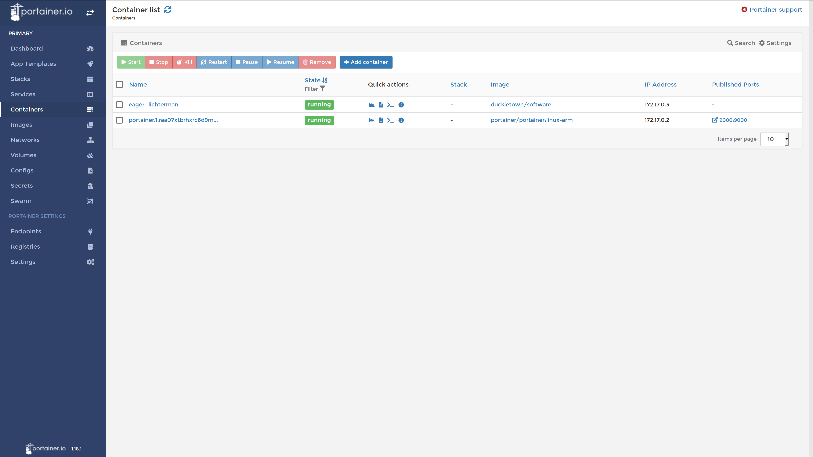
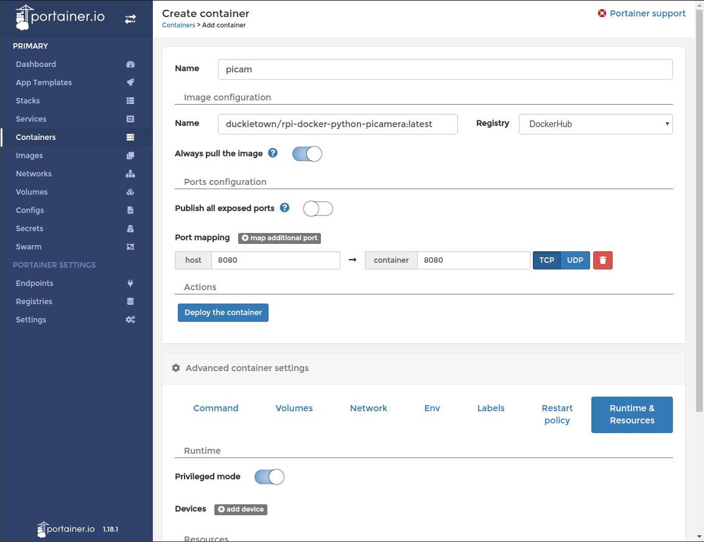
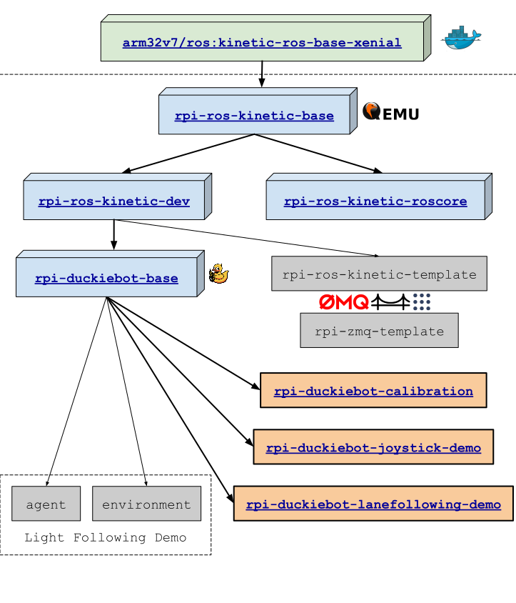
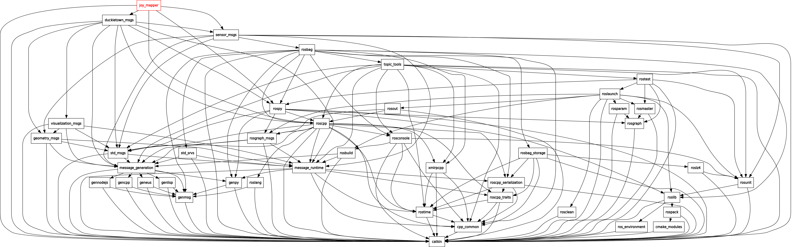
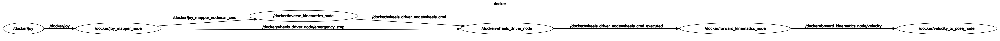

# Duckiebot Development using Docker {status=ready}

The following section will guide you through the Docker development process.

<style>
figure img {
max-width: 100%;
}
</style>


## Prerequisites

Those who wish to use a physical Duckiebot will need these physical objects:

* Duckiebot

    * Raspberry Pi 3B+
    * Micro SD card (16GB+ reccommended)

* Personal computer
* Internet-enabled router
* MicroSD card adapter

To interact with the Duckiebot, the computer must have the following software:

* POSIX-compliant shell
* Browser and/or [Docker CE](https://www.docker.com/community-edition#/download)

## Installation

* Software Prerequisites (Ubuntu/Debian):

    * `wget`/`curl`
    * `apt-get`
    * [`duckietown-shell`](https://github.com/duckietown/duckietown-shell)
    * Docker (See [](#docker-intro) for installation instructions)

First, you will need to set your Duckietoken:

    $ dts tok set

Now, ensure that you have a valid Duckietoken:

    $ dts tok verify $TOKEN
    
    0 -> good   JSON {'uid': number, 'exp': date}
    1 -> bad  error message

Place the Duckiebot's MicroSD card into the MicroSD card adapter, insert it into the computer and run the following command:

    $ dts init_sd_card     

The above command runs the [`init_sd_card.sh` script](https://github.com/duckietown/duckietown-shell-commands/blob/master/init_sd_card.scripts/init_sd_card.sh), which will run an installer to prepare the SD card.

Follow the instructions, then transfer the SD card to the Raspberry Pi and power on the Duckiebot. On first boot, make sure the Raspberry Pi receives continuous power for at least five or ten minutes.

TODO: give some sign of life, maybe LEDs. 

Your laptop should be connected to the same network as the Duckiebot, or alternately, you will need to share internet from your laptop to your Duckiebot via an ethernet cable. Further details are described in the [Duckiebot networking](http://docs.duckietown.org/DT18/opmanual_duckiebot/out/duckiebot_network.html) chapter.

Wait for a minute or so, and then visit the following URL:

`http://![DUCKIEBOT_NAME].local:9000/`

You should be greeted by the Portainer web interface. This user-friendly web interface is the primary mechanism for interacting with a Duckiebot.

From here you can see the list of running containers on your Duckiebot:

<figure>
 
 <figcaption>Portainer Container View</figcaption>
</figure>

You can attach a console to a running container and interact with it via the browser:

<figure>
 
 <figcaption>Portainer Web Interface</figcaption>
</figure>

If you prefer to use the command line, you can also connect to the Duckiebot via secure shell:

    $ ssh ![USER_NAME]@![DUCKIEBOT_NAME].local

Note: Any Docker command can also be run remotely by using the hostname flag, `-H ![DUCKIEBOT_NAME]`. You should not need to open an SSH connection simply to run a Docker command.


## Running Simple HTTP File Server

All persistent data is stored under `/data` on the Duckiebot SD card. To access the data via the web browser, run:

    $ docker -H ![DUCKEBOT_NAME].local run -d \
      --name file-server \
      -v /data:/data \ 
      -p 8082:8082 \
      duckietown/rpi-simple-server:master18 

Go to the following URL: `http://![DUCKIEBOT_NAME].local:8082/`

## Testing the camera

Open Portainer Web interface and run the `duckietown/rpi-docker-python-picamera` container.

Publish port 8081 and ensure that the container is run in "Privileged" mode.

<figure>
 
 <figcaption>Portainer PiCam Demo</figcaption>
</figure>

    $ docker -H ![DUCKIEBOT_NAME].local run -d \
      --name picam \
      -v /data:/data \
      --privileged \
      -p 8081:8081 \
      duckietown/rpi-docker-python-picamera:master18


Note: The syntax `-H ![DUCKIEBOT_NAME].local` may be omitted if you are running the command over SSH.


Visit the following URL: `http://![DUCKIEBOT_NAME].local:8082/image.jpg`.


## Testing ROS

It is best to first pull the `base` Duckietown Docker image using the following command:

    $ docker -H ![DUCKIEBOT_NAME].local pull duckietown/rpi-ros-kinetic-roscore:master18

Run the `base` Duckietown Docker image, opening a shell:

    $ docker -H ![DUCKIEBOT_NAME].local run -it \
      --name roscore \
      --privileged \
      --net host \
      duckietown/rpi-ros-kinetic-roscore:master18

You can start a ROS environment on your laptop, which connects to the Duckiebot ROS Master:

    $ nvidia-docker run -it --rm \
      --name ros \
      --net host \
      --env ROS_HOSTNAME=$HOSTNAME \
      --env ROS_MASTER_URI=http://![DUCKIEBOT_IP]:11311 \
      --env ROS_IP=![LAPTOP_IP] \
      --env="DISPLAY" \
      --env="QT_X11_NO_MITSHM=1" \
      --volume="/tmp/.X11-unix:/tmp/.X11-unix:rw"\
      rosindustrial/ros-robot-nvidia:kinetic

To allow incoming X connections, run `xhost +` on your computer.

Note: There is a [more secure way](http://wiki.ros.org/docker/Tutorials/GUI#The_safer_way) to do this, if you are concerned about receiving arbitrary X11 connections.

The above command opens a "ROS" shell running on your laptop that is set to connect to `DUCKIEBOT`'s ROS Master.
To test the ROS connection, run `roswtf`:

    $ roswtf

----------------------

## Test ROS Joystick

    $ docker -H ![DUCKIEBOT].local run -d \
        --name joystick-demo \
        --privileged \
        -v /data:/data \
        --net host \
        duckietown/rpi-duckiebot-joystick-demo:master18

## Calibration

As described in [](+opmanual_duckiebot#camera-calib), print the calibration pattern and place the Duckiebot in the proper position.

### Extrinsic calibration procedure

Launch the calibration container and follow the prompts:

    $ docker -H ![DUCKIEBOT_NAME].local run -it \
      --name calibration \
      --privileged \
      -v /data:/data \
      --net host \
      duckietown/rpi-duckiebot-calibration:master18

You will first be asked to place the Duckiebot on the calibration pattern. Then you will be asked to place in a lane to test the calibration.

Note: Passing `-v /data:/data` is necessary so that all calibration settings will be preserved.

Note: You can run/launch the `rpi-simple-server` to see the results in your web browser; you can also download all files from `/data`. This is an easy way to view and download all calibration files and validation results.

## Lane Following Demo

After the Duckiebot has been calibrated, you can now launch the [Lane Following Demo](+opmanual_duckiebot#demo-lane-following).


    $ docker -H ![DUCKIEBOT_NAME].local run -it \
      --name lanefollowing-demo \
      --privileged \
      -v /data:/data \
      --net host \
      duckietown/rpi-duckiebot-lanefollowing-demo:master18


Wait for a few minutes for all nodes to be started and initialized.

You can test the Duckiebot by using the Joystick. Pressing `R1` starts `autonomous` mode.

Pressing `L1` puts the Duckiebot back in `manual` mode.

## Development workflow

When developing Docker containers, there are two paths to deployment. You can write the `Dockerfile` on your laptop or an x86 machine, then build with the `RUN [ "cross-build-start" ]` and `RUN [ "cross-build-end" ]` commands. Once tested, you can deploy to the Duckiebot directly by running the following command:

```
laptop $ docker save ![TAG_NAME] | ssh -C duckie@![DUCKIEBOT_NAME].local docker load
```

Alternately, you can build directly on an ARM device by creating a file named `Dockerfile.arm` (the `.arm` extension is just for the reader's benefit), adding a base image and some build instructions, and running the command:

```
duckiebot $ docker build --file=[FILE PATH]/Dockerfile.arm --tag [TAG NAME] . # Where `.` is the build context path
```

Note that ARM-specific `Dockerfile`s will not build on non-Mac x86 machines, and attempting to build one will cause an error on Docker Hub. However, once you have debugged the `Dockerfile` on an ARM device, you can easily port the entire build to x86 by enclosing it with `RUN [ "cross-build-start" ]` and `RUN [ "cross-build-end" ]` instructions, after the `FROM` and before the `CMD` directive, as [seen here](https://github.com/duckietown/rpi-ros-kinetic-base/blob/241a08a6f1be203325fc66086fa3a04d521e6029/Dockerfile#L14:L92). Don't forget to publish to GitHub and set up a Docker Hub automatic rebuilds if you wish to automate the build.

## Emulation

All Duckietown Docker images contain an emulator called [QEMU](https://www.qemu.org/) - this allows us to run ARM images on x86 directly. To run a pure compute ROS node (i.e. one that does not require any camera or motor access) on a non-Mac x86 platform, you will need to provide a custom entrypoint to Docker when running the image. To do so, use the command `docker run ... --entrypoint=qemu3-arm-static ![YOUR_IMAGE] [RUN_COMMAND]`, where `RUN_COMMAND` may be a shell such as `/bin/bash` or another command such as `/bin/bash -c "roscore"`. The `qemu3-arm-static` entrypoint is provided by [duckietown/rpi-ros-kinetic-base](https://github.com/duckietown/rpi-ros-kinetic-base), and may be upated in the future.

## Common mistakes

### exec user process caused "exec format error"

If you encounter this error, this means the container you are attempting to run is based on an image that is incompatible with the host's architecture. If you are trying to run an ARM image on an x86 host, you will need to use [QEMU](https://www.qemu.org/) to emulate the ARM processor architecture. To run QEMU in Duckietown or Resin derived Docker image, use the flag `--entrypoint=qemu-arm-static` in your Docker run command. There is currently no solution for running x86 images on an ARM host, so you will need to build ARM-specific images for the Raspberry Pi.

## Resources and References

### SD Card Configuration and Flashing script

* https://github.com/duckietown/scripts
* https://github.com/duckietown/scripts/blob/master/docs/DuckieOS1-RPI3Bp.sh

### RPi Camera Test container

* https://github.com/rusi/rpi-docker-python-picamera
* https://hub.docker.com/r/duckietown/rpi-docker-python-picamera/

### RPi Simple HTTP File Server

* https://github.com/rusi/rpi-simple-server
* https://hub.docker.com/r/duckietown/rpi-simple-server/

## Duckiebot ROS containers

The following containers are very useful for getting started.

### Base ROS container; opens `bash` when launched

* https://github.com/duckietown/rpi-ros-kinetic-base
* https://hub.docker.com/r/duckietown/rpi-ros-kinetic-base

### Base ROS container with development tools and Duckietown dependencies (includes `picamera`)

* https://hub.docker.com/r/duckietown/rpi-ros-kinetic-dev

### `roscore` container - starts `roscore` when launched

* https://github.com/duckietown/rpi-ros-kinetic-roscore
* https://hub.docker.com/r/duckietown/rpi-ros-kinetic-roscore

### Duckietown Base (monolithic) software container - opens `bash` when launched

* https://github.com/duckietown/Software
* https://hub.docker.com/r/duckietown/rpi-duckiebot-base

### Joystick Demo container

* https://github.com/duckietown/rpi-duckiebot-joystick-demo
* https://hub.docker.com/r/duckietown/rpi-duckiebot-joystick-demo

### Calibration container

* https://github.com/duckietown/rpi-duckiebot-calibration
* https://hub.docker.com/r/duckietown/rpi-duckiebot-calibration

### Lane Following Demo container

* https://github.com/duckietown/rpi-duckiebot-lanefollowing-demo
* https://hub.docker.com/r/duckietown/rpi-duckiebot-lanefollowing-demo

### Desktop ROS containers

rosindustrial/ros-robot-nvidia:kinetic

* https://github.com/ros-industrial/docker
* https://hub.docker.com/r/rosindustrial/ros-robot-nvidia/

osrf/ros:kinetic-desktop-full

* https://github.com/osrf/docker_images/blob/master/ros/kinetic/ubuntu/xenial/desktop-full/
* https://hub.docker.com/r/osrf/ros/

## Docker Image Hierarchy

<figure>
 
 <figcaption>Docker Image Hierarchy</figcaption>
</figure>

## Misc

### Building images:

    $ cd image-builder-rpi
    $ docker build . --tag ![TAG_NAME]

### Transferring Docker containers

    $ docker save ![TAG_NAME] | gzip | ssh -C duckie@![DUCKIEBOT_NAME].local docker load

<figure markdown="1">
 
 <figcaption> Output of `rqt_dep joystick` (compilation dependencies)</figcaption>
</figure>

<figure markdown="1">
 
 <figcaption> Output of `rqt_graph joystick` (runtime dependencies)</figcaption>
</figure>
