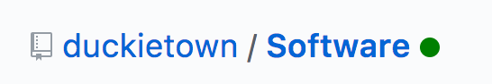
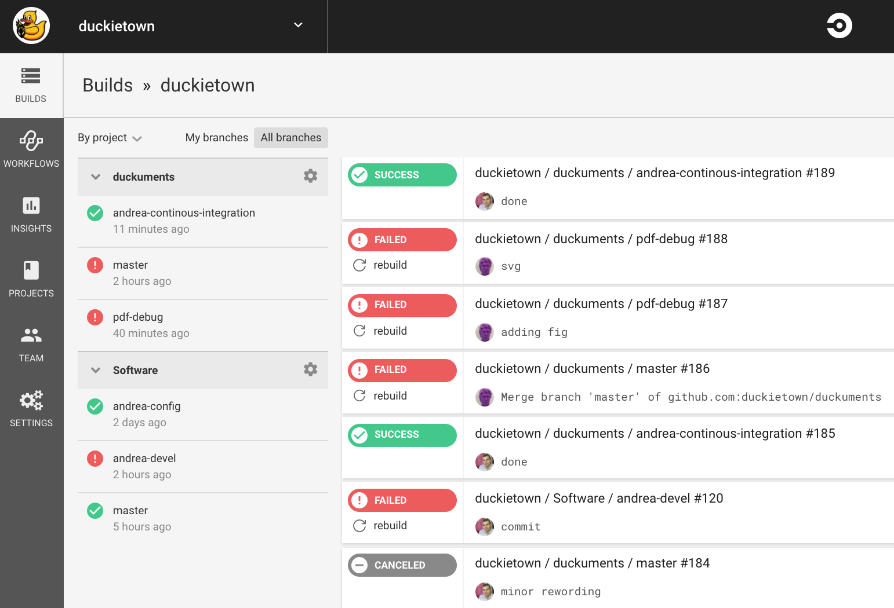

# Continuous integration {#continuous-integration status=ready}

These are the conventions for the Duckietown repositories.

<minitoc/>

## Never break the build

The `Software` and the `duckuments` repository use "continuous integration".

This means that there are well-defined tests that must pass at all times.

For the `Software` repository, the tests involve building the repository and running unit tests.

For the `duckuments` repository, the tests involve trying to build the documentation using `make compile`.

If the tests do not pass, then we say that we have "broken the build".

We also say that a branch is "green" if the tests pass, or "red" otherwise.

If you use the Chrome extension [Pointless](https://github.com/felicianotech/pointless),
you will see a green dot in different places on Github to signify the status of the build ().

<figure id="fig:green-dot">
    <figcaption>The green dot is good.</figcaption>
    
</figure>

## How to stay in the green

The system enforces the constraint that the branch `master` is always green,
by preventing changes to the branches that make the tests fail.

We use a service called CircleCI. This service continuously looks at our
repositories. Whenever there is a change, it downloads the repositories and runs the tests.

(It was a lot of fun to set up all of this, but fortunately you do not need to know how it is done.)

At [this page](https://circleci.com/gh/duckietown) you can see the summary of the tests.
(You need to be logged in with your Github account and click "authorize Github").

<figure id="fig:circleci">
    <figcaption>The CircleCi service dashboard, 
    available at <a href="https://circleci.com/gh/duckietown">this page.</a></figcaption>
    
</figure>

## How to make changes to `master`: pull requests

It is not possible to push on to the master branch directly.

See: See the [Github documentation about pull requests](https://help.github.com/articles/about-pull-request-merges/) to learn about the
general concept.

The workflow is as follows.

(1) You make a private branch, say `![your name]-devel`.

(2) You work on your branch.

(3) You push often to your branch. Every time you push, CircleCI will run the tests and let you know if the tests are passing.

(4) When the tests pass, you create a "pull request". You can do this by going to the Github page for your branch and click on the button "compare and pull request" ().

(5) You now have an opportunity to summarize all the changes you did so far (). Then click "create pull request".

(6) Now the pull request has been created. Other people can see and comment on it. However, it has not been merged yet.

At this point, it might be that it says "Some checks haven't completed yet" ().
Click "details" to see what's going on, or just wait.

When it's done, you will see either a success message ()
or a failure message ().

(7) At this point, you can click "squash and merge" to merge the changes into master ().

### Troubleshooting

If you see a message like "merge failed" (), it probably means that somebody pushed into master; merge master into your branch and continue the process.

<!--

# Continuous integration {#continuous-integration}

## Create a CircleCI account

TODO

## See the status of a build

[See here][build] to monitor the status of a build.

[build]: https://circleci.com/gh/duckietown -->
