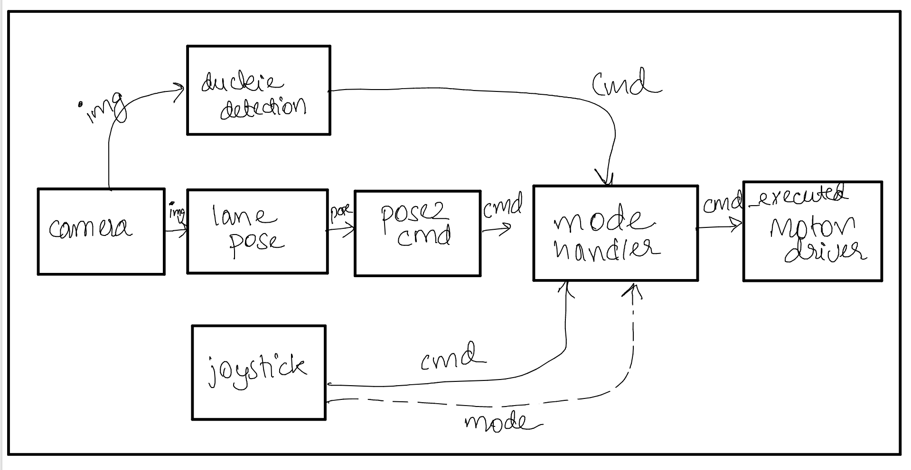

# Introduction to ROS {#ros-intro status=ready}

The [official wiki](http://wiki.ros.org/ROS/Introduction) describes ROS as:
```
... an open-source, meta-operating system for your robot. It provides the services you would expect from an operating system, including hardware abstraction, low-level device control, implementation of commonly-used functionality, message-passing between processes, and package management. It also provides tools and libraries for obtaining, building, writing, and running code across multiple computers.
```

You probably have some idea about what the above words mean. However, if this is your first encounter with ROS, you are already overestimating how complicated it is. Do not worry.

Putting it in very simple terms, as a roboticist, ROS is what will prevent you from reinventing the wheel at every step. It is a framework which helps you manage the code you write for your robot, while providing you with a plethora of tools which will help you along the way. 

<div class='requirements' markdown='1'>
  Requires: [Laptop setup](+opmanual_duckiebot#laptop-setup)

  Requires: [Duckiebot initialization](+opmanual_duckiebot#setup-duckiebot)

  Requires: [Docker poweruser skills](#docker-poweruser)

  Results: Basic understanding of ROS
</div>

<minitoc/>

## Why ROS? {#why-ros status=ready}

Your Duckiebot is a very simple robot which has only one sensor (the camera), and two actuators (the motors). You can probably write all the code for the basic funtionality of a Duckiebot yourself. You start by getting images from the camera, processing them to detect lanes, generating suitable motor commands, and finally executing them. You create a single program for all of this which looks like this:

```python
img = get_image_from_camera()
pose = get_pose_from_image(img)
cmd = get_command_from_pose(pose)
run_motors(cmd)
```

The next day, your Duckiebot crashes into a duckie which was crossing the road, so you want to add duckie detection into your program to prevent such accidents. You modify your program and it now looks like this: 

```python
img = get_image_from_camera()
pose = get_pose_from_image(img)
cmd = get_command_from_pose(pose)

if duckie_detected(img):
    cmd = EMERGENCY_STOP

run_motors(cmd)
```


You realize, however, that your Duckiebot is not at level 5 autonomy yet and you want to add manual control for difficult to navigate regions in the city. Your code now looks like this:

```python
img = get_image_from_camera()
pose = get_pose_from_image(img)
cmd = get_command_from_pose(pose)

if mode == AUTONOMOUS:
    if duckie_detected(img):
        cmd = EMERGENCY_STOP
else:
    cmd = get_command_from_joystick()

run_motors(cmd)
```

It is easy to see that when you start thinking about having even more advanced modes of operation such as intersection navigation, Duckiebot detection, traffic sign detection, and auto-charging, your program will end up being a massive stack of if-else statements. What if you could split your program into different independent building blocks, one which only gets images from cameras, one which only detects duckie pedestrians, one which controlls the motors, and so on. Would that help you with organizing your code in a better way? How would those blocks communicate with each other? Moreover, how do you switch from autonomous mode to manual mode while your Duckiebot is still running?

What happens when you try to do this for advanced robots with a lot of sensors and a large number of possible behaviors?

## Basics of ROS {#ros-basics status=ready}
Look at the following system (TODO: proper diagram, make nodes ellipses and topics in rectangles, update text accordingly)
<figure>
  
</figure>


It performs exactly the same task as before. Unlike before, each of the building blocks is independent from the rest of the blocks, which means that you can swap out certain parts of the code with those written by others. You can write the lane pose extraction algorithm, while your friend works on converting that pose to a motor command. During runtime, the lane pose extractor and duckie detection algorithm run in parallel, just helping you utilize your resources better. The only missing piece to get a working system is making these blocks communicate with each other. This is where ROS comes in. If you don't want to write your own driver for the camera, you could very easily use one from any ROS robot using the PiCamera.

In ROS terminology, each box is a `node`, and each solid arrow connection is a `topic`. It is intuitive that each `topic` carries a different type of `message`. The img `topic` has images which are matrices of numbers, whereas the pose `topic` may have rotation and translation components. ROS provides a lot of standard `message` types ranging from Int, Bool, String to Images, Poses, IMU. You can also define your own `messages`. 

The `nodes` which send out data on a `topic` are called `publishers` of that `topic` and the ones which receive the data and use it are called `subscribers` of that `topic`. As you may have noticed from the diagram above, a `node` can be a `publisher` for one topic and `subscriber` for another at the same time. 

You may have noticed a dashed arrow from the `joystick` node to the `mode_handler`. This represents that you can switch from manual to autonomous mode and vice versa using a button on your joystick. Unlike sending images, which is a continuous flow of information, you will not keep switching modes all the time. This in ROS is called a `service`. Just like `messages`, you can also define your own `services`. Here, the `mode_handler` node offers a `service` and the `joystick` node is the client of that service. 

What manages the connections between nodes is the `rosmaster`. The `rosmaster` is responsible for helping individual nodes find one another and setting up connections between them. This can also be done over a network. Remember how you were able to [see what your Duckiebot sees](+opmanual_duckiebot#read-camera-data)? That was because your laptop connected to the `rosmaster` of your Duckiebot. 

Another key building block of ROS are the `parameters` for each node. Recall when you [calibrated your Duckiebot's wheels](+opmanual_duckiebot#wheel-calibration) or [camera](+opmanual_duckiebot#camera-calib). These calibration parameters need to be stored somewhere so that they are not lost when your Duckiebot powers off. You will also need `parameters` in conjunction with `services`. (Why?) 

In ROS, code is organized in the form of `packages`. Each `package` is essentially a collection of `nodes` which perform very specific, related tasks. ROS `packages` also contain `messages`, `services`, and `parameter` files used by the nodes. A standard ROS package looks like this: (TODO: insert package image)

When developing a large software stack, you may also find it easier to have all `messages`, `services`, and `parameter` files used by all nodes running on your robot in a single package rather than spread out inside packages which use them to avoid unneccessary redefinitions. The nodes, however, remain in their own packages. (Why? Does it have something to do with the fact that multiple `nodes` might use the same `message`, etc.?) 

Note that the above diagram is just one of the ways to organize the flow of data. What happens actually on your Duckiebot is a little different. 

## Installation (Optional) {#ros-installation status=ready}
If you wish to install ROS on your computer, you can do so using this [link](http://wiki.ros.org/ROS/Installation). Please note that this might not be possible depending on your OS. Regardless of what OS you use, you should be able to use ROS through Docker (Why?). All ROS development in Duckietown happens through Docker. This is why this step is not mandatory. 

## ROS Tutorials {#ros-tutorials status=ready}

Tutorials on using ROS with Duckietown are covered in the [next section](#dt-infrastructure). These tutorials are tailored to the Duckietown development process. Apart from this, we strongly recommend going through the official [ROS tutorials](https://wiki.ros.org/ROS/Tutorials). You should even try out the Beginner Level tutorials yourself if you have a native ROS installation. If not, read through them at least and proceed to the [next section](#dt-infrastructure) 


### Additional Reading {#ros-additional status=ready}
- [ROS Graph Concepts](http://wiki.ros.org/ROS/Concepts)

