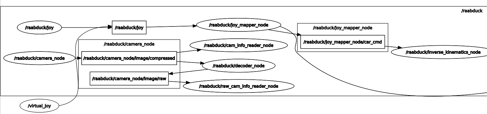

# Useful Commands {#ros-commands status=ready}
Here are just a few useful commands that can help with debugging

## Nodes, Topics, Services

See all topic names:

	laptop $ rostopic list

Print topic messages to terminal:

	laptop $ rostopic echo ![topic name]

See frequency of messages published on topic:

	laptop $ rostopic hz ![topic name]

See which node is publishing and subscribing to a topic

	laptop $ rostopic info ![topic name]

## rqt

rqt is a collection of packages and tools for debugging in ROS

See a graph of all nodes and topics:

	laptop $ rqt_graph

Here is an example graph.

## rviz

rviz is a tool for visualizing data from topics.

	laptop $ rviz

On the left panel you can add visualizations based on message type for topic.
