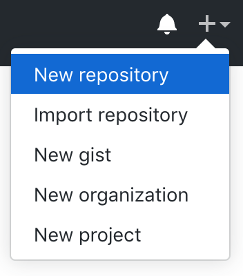
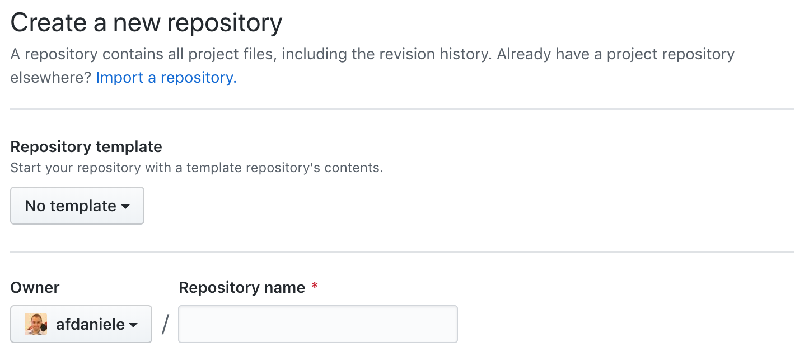
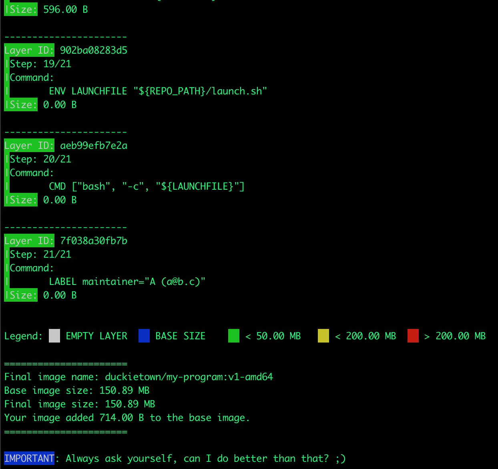

# Development in the Duckietown infrastructure {#dt-infrastructure status=ready}

In this section, you will learn everything about creating a Duckietown-compliant Docker image with ROS.


<div class='requirements' markdown='1'>
  Requires: [Laptop setup](+opmanual_duckiebot#laptop-setup)

  Requires: [Duckiebot initialization](+opmanual_duckiebot#setup-duckiebot)

  Requires: [Docker poweruser skills](#docker-poweruser)
  Requires: [Basic understanding of ROS](#ros-intro) 
  Results: Developer knowledge of ROS
</div>

<minitoc/>

## Basic Project Structure {#basic-structure status-ready}
In Duckietown, everything runs in Docker containers. All you need in order to run a piece of software that uses ROS in Duckietown is a Duckietown-compliant Docker image with your software in it.

A boilerplate is provided [here](https://github.com/duckietown/template-ros). The repository contains a lot of files, but do not worry, we will analyze them one by one.

First of all, you will need to make a copy of the template in your own GitHub account. To do so, visit [this](https://github.com/duckietown/template-ros) URL and click on the fork button.

<figure>
  
</figure>

Now that you have a copy of the template, you can create new repositories based off of it. In order to do so, go to [GitHub](https://github.com/) and click on the button [+] at the top-right corner of the page and then click on New Repository. 

<figure>
  
</figure>

You will see a page that looks like the following:

<figure>
  
</figure>

In the section **Repository template**, select **YOUR_NAME/template-ros**. Pick a name for your repository (say `my-ros-program`) and press the button **Create repository**. Note, you can replace `my-ros-program` with the name of the repository that you prefer, make sure you use the right name in the instructions below.

This will create a new repository and copy everything from the repository `template-ros` to your new repository. You can now open a terminal and clone your newly created repository.


    laptop $ git clone https://github.com/![YOUR_NAME]/my-ros-program
    laptop $ cd my-ros-program

**NOTE**: Replace `YOUR_NAME` in the link above with your GitHub username.

The repository contains already everything you need to create a Duckietown-compliant Docker image for your ROS program. The only thing we need to change before we can build an image from this repository is the repository name in the file `Dockerfile`. Open it using the text editor you prefer and change the first line from:

```bash
ARG REPO_NAME="<REPO_NAME_HERE>"
```
to
```bash
ARG REPO_NAME="my-ros-program"
```

Save the changes. 

We can now build the image, even though there won't be much going on inside it until we place our code in it.

Open a terminal and move to the directory created by the git clone instruction above. Run the following command:


    laptop $ dts devel build -f --arch amd64


If you correctly installed Docker and the duckietown-shell, you should see a long log that ends with something like the following:
<figure>
  
</figure>

You can now run your container by executing the following command.


    laptop $ docker run -it --rm duckietown/my-ros-program:v1-amd64


This will show the following message:

```
The environment variable VEHICLE_NAME is not set. Using '63734f6b4e7c'.
This is an empty launch script. Update it to launch your application.
```

**CONGRATULATIONS!** You just built and run your first ROS-based Duckietown-compliant Docker image.

## ROS Publisher on Laptop {#ros-pub-laptop status-ready}

Now that we know how to build a Docker image for Duckietown, let’s put some code in one of them. We will see how to write a simple ROS program with Python, but any language supported by ROS should do it.

Open a terminal and go to the directory `my-ros-program` created above. In ROS, every ROS `node` must belong to a ROS `package`. ROS packages are placed inside the directory `packages` in `my-ros-program`. Let go ahead and create a directory called `my_package` inside `packages`.

    laptop $ mkdir -p ./packages/my_package

A ROS `package` is simply a directory containing two special files, `package.xml` and `CMakeLists.txt`. So, let’s turn the `my_package` folder into a ROS package by creating these two files.

Create the file `package.xml` inside `my_package` using your favorite text editor and place/adjust the following content inside it:

```xml
<?xml version="1.0"?>
<package>
  <name>my_package</name>
  <version>0.1.0</version>
  <description>
  This package is a test for RH3.
  </description>
  <maintainer email="YOUR_EMAIL@EXAMPLE.COM">YOUR_FULL_NAME</maintainer>
  <license>None</license>

  <buildtool_depend>catkin</buildtool_depend>
</package>
```

Create the file `CMakeLists.txt` inside my_package using your favorite text editor and place/adjust the following content inside it:

```cmake
cmake_minimum_required(VERSION 2.8.3)
project(my_package)

find_package(catkin REQUIRED COMPONENTS
  rospy
)

catkin_package()
```

Now that we have a ROS `package`, we can create a ROS `node` inside it. Create the directory `src` inside `my_package` and use your favorite text editor to create the file `./packages/my_package/src/my_node.py` and place the following code inside it:

```python
#!/usr/bin/env python

import os
import rospy
from duckietown import DTROS
from std_msgs.msg import String

class MyNode(DTROS):

    def __init__(self, node_name):
        # initialize the DTROS parent class
        super(MyNode, self).__init__(node_name=node_name)
        # construct publisher
        self.pub = rospy.Publisher('chatter', String, queue_size=10)

    def run(self):
        # publish message every 1 second
        rate = rospy.Rate(1) # 1Hz
        while not rospy.is_shutdown():
            message = "Hello World!"
            rospy.loginfo("Publishing message: '%s'" % message)
            self.pub.publish(message)
            rate.sleep()

if __name__ == '__main__':
    # create the node
    node = MyNode(node_name='my_node')
    # run node
    node.run()
    # keep spinning
    rospy.spin()
```

And don’t forget to declare the file `my_node.py` as an executable, by running the command:

    laptop $ chmod +x ./packages/my_package/src/my_node.py


We now need to tell Docker we want this script to be the one executed when we run the command `docker run ...`. In order to do so, open the file `launch.sh` and replace the line

```bash
echo "This is an empty launch script. Update it to launch your application."
```

with the following lines 

```bash
roscore &; sleep 5
rosrun my_package my_node.py
```

Let us now re-build the image

    laptop $ dts devel build -f --arch amd64

and run it

    laptop $ docker run -it --rm duckietown/my-ros-program:v1-amd64

This will show the following message:

```
The environment variable VEHICLE_NAME is not set. Using 'b17d5c5d1855'.
... logging to /root/.ros/log/45fb649e-e14e-11e9-afd2-0242ac110004/roslaunch-b17d5c5d1855-56.log
Checking log directory for disk usage. This may take awhile.
Press Ctrl-C to interrupt
Done checking log file disk usage. Usage is <1GB.

started roslaunch server http://172.17.0.4:46725/
ros_comm version 1.12.14


SUMMARY
========

PARAMETERS
 * /rosdistro: kinetic
 * /rosversion: 1.12.14

NODES

auto-starting new master
process[master]: started with pid [67]
ROS_MASTER_URI=http://172.17.0.4:11311/

setting /run_id to 45fb649e-e14e-11e9-afd2-0242ac110004
process[rosout-1]: started with pid [80]
started core service [/rosout]
[INFO] [1569606196.137620]: [/my_node] Initializing...
[INFO] [1569606196.148146]: Publishing message: 'Hello World!'
[INFO] [1569606197.149378]: Publishing message: 'Hello World!'
[INFO] [1569606198.149470]: Publishing message: 'Hello World!'
```

**CONGRATULATIONS!** You just built and run your own Duckietown-compliant ROS publisher.

## ROS Publisher on Duckiebot {#ros-pub-laptop status-ready} 

Now that we know how to package a piece of software into a Docker image for Duckietown, we can go one step further and write code that will run on the robot instead of our laptop.

This part assumes that you have a Duckiebot up and running with hostname ![MY_ROBOT]. Of course, you don’t need to change the hostname to ![MY_ROBOT], just replace it with your robot name in the instructions below. You can make sure that your robot is ready by executing the command 

    laptop $ ping ![MY_ROBOT].local

If you can ping the robot, you are good to go.

Before you start, you need to configure the Duckiebot to accept new code. This is necessary because the Duckiebot by defaults runs only code released by the Duckietown community. In order to configure the robot to accept custom code, run the following command,

    laptop $ dts devel watchtower stop -H MY_ROBOT.local

**Note**: You need to do this once and the effect will be lost when the Duckiebot reboots.

Let us go back to our node file my_node.py and change the line:

```python
...
            message = "Hello World!"
...
```

to,

```python
...
            message = "Hello from %s" % os.environ['VEHICLE_NAME']
...
```

Since `roscore` is already running on the Duckiebot, we need to **remove** the following line from `launch.sh`

```bash
roscore &; sleep 5
```

We can now slightly modify the instructions for building the image so that the image gets built directly on the robot instead of your laptop or desktop machine. Run the command

    laptop $ dts devel build -f --arch arm32v7 -H MY_ROBOT.local

As you can see, we changed two things, one is `--arch arm32v7` which tells Docker to build an image that will run on `ARM` architecture (which is the architecture the CPU on the robot is based on), the second is `-H ![MY_ROBOT].local` which tells Docker where to build the image. 

Once the image is built, we can run it on the robot by running the command
    
    laptop $ docker -H MY_ROBOT.local run -it --rm --net=host duckietown/my-ros-program:v1

If everything worked as expected, you should see the following output,

```
The environment variable VEHICLE_NAME is not set. Using 'riplbot01'.
[INFO] [1569609192.728583]: [/my_node] Initializing...
[INFO] [1569609192.747558]: Publishing message: 'Hello from riplbot01'
[INFO] [1569609193.749251]: Publishing message: 'Hello from riplbot01'
[INFO] [1569609194.749195]: Publishing message: 'Hello from riplbot01'
```

**CONGRATULATIONS!** You just built and run your first Duckietown-compliant and Duckiebot-compatible ROS publisher.
